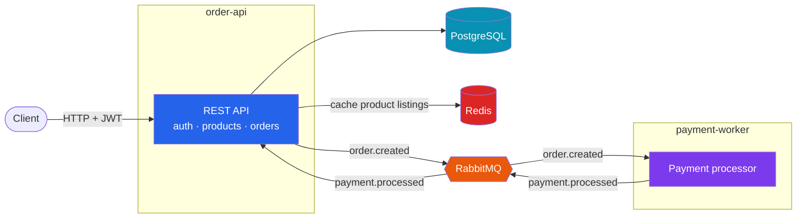
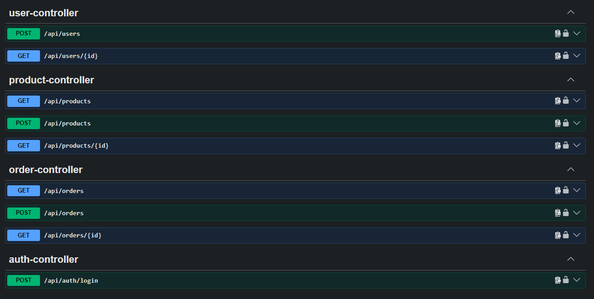

# Distributed Order Processing Platform

A distributed backend for an online store composed of two independent Spring Boot services `order-api` and `payment-worker` that communicate through RabbitMQ. Handles product catalog, order placement, JWT-based auth with role-based and object-level authorization, and asynchronous payment processing with retry and dead-letter handling.

## Tech stack

Java 17 · Spring Boot 4 · Spring Security (JWT) · Spring Data JPA · PostgreSQL · Redis · RabbitMQ · Docker · JUnit 5 · Mockito · Testcontainers · GitHub Actions

## Architecture



`order-api` owns the customer-facing REST API, Postgres, and Redis. `payment-worker` only knows how to consume an `order.created` event, simulate a payment charge, and publish a `payment.processed` event back. Neither service knows the other exists beyond the events they publish and consume through the message queue.

## Design & Implementation Notes

| Note | Details |
|---|---|
| **Pessimistic locking prevents overselling** | [`ProductRepository.findByIdForUpdate`](order-api/src/main/java/com/hasnain/orderapi/repository/ProductRepository.java) takes a `PESSIMISTIC_WRITE` lock before decrementing stock, so two concurrent orders for the same product can't both read stale stock and both succeed. Covered by a concurrency test ([`ProductRepositoryContainerIT`](order-api/src/test/java/com/hasnain/orderapi/repository/ProductRepositoryContainerIT.java)) that fires two threads at the same product and asserts exactly one wins. |
| **Retry and dead-lettering on failures and errors** | Encountering a rare exception (e.g provider unreachable) triggers RabbitMQ's retry interceptor (3 attempts, exponential backoff), landing on a dead-letter queue if it still fails. |
| **Redis caches product listings, evicting the whole cache on writes** | [`ProductService.getAllProducts`](order-api/src/main/java/com/hasnain/orderapi/service/ProductService.java) caches each page/size combination for 10 minutes. Creating a product evicts the entire cache since pagination offsets shift for every page once a new row exists. |
| **Role & Object-level authorization** | Calls go through [`SecurityConfig`](order-api/src/main/java/com/hasnain/orderapi/config/SecurityConfig.java) first for coarse, role-based gating (e.g. only `ROLE_ADMIN` can create products), then finer-grained authorization happens in the service layer, checking things like resource ownership to guard against IDOR. |
| **Entities never cross the API boundary** | Every controller method takes and returns a DTO, never a JPA entity, visible directly in the Swagger schemas panel: [`UserResponse`](order-api/src/main/java/com/hasnain/orderapi/dto/UserResponse.java) (id, email, role) appears, [`User`](order-api/src/main/java/com/hasnain/orderapi/entity/User.java) (which also carries a password hash) never does. |

## Limitations

- No transactional outbox on `order-api`'s event publish: the database write and the event publish to the message queue aren't atomic, so if the transaction rolled back after the message was already sent, the two would be out of sync.
- The "payment gateway" itself is simulated: `payment-worker` just rolls a random number to decide success, decline, or an unreachable provider, standing in for a real integration like Stripe.
- JWTs can't be revoked before they naturally expire: there's no server-side denylist, so a leaked token stays valid for its full lifetime.
- No admin bootstrap process: the only admin account comes from the demo seeder, and there is no real provisioning flow for a new admin.
- Lack of observability beyond logs: no metrics or tracing across the async flow.

## Prerequisites

- Docker

## Quickstart

```bash
git clone https://github.com/hasnainn19/order-processing-platform.git
cd order-processing-platform
cp .env.example .env
docker compose up --build
```

The database is auto-seeded on first boot with 1 admin, 10 users, 200 products, and 35 orders.

## See it in action

| | |
|---|---|
| API | [http://localhost:8080](http://localhost:8080) |
| Interactive docs | [http://localhost:8080/swagger-ui.html](http://localhost:8080/swagger-ui.html) |
| RabbitMQ management UI | [http://localhost:15672](http://localhost:15672) (login: values of `RABBITMQ_USER` / `RABBITMQ_PASSWORD` in `.env`) |

**Seeded login**: every seeded account shares the same password:

| Email | Role | Password |
|---|---|---|
| `admin@example.com` | ADMIN | `password123` |
| `john.doe@example.com` (and 9 others, see [`DataSeeder`](order-api/src/main/java/com/hasnain/orderapi/seed/DataSeeder.java)) | USER | `password123` |

`order-api` ships with auto-generated, interactive API docs (via springdoc-openapi) once it's running at [http://localhost:8080/swagger-ui.html](http://localhost:8080/swagger-ui.html): every endpoint, every request/response schema, with a built-in "Authorize" flow for testing protected routes with a real JWT.



Otherwise, here is the same flow with `curl`.

```bash
# Register
curl -X POST http://localhost:8080/api/users \
  -H "Content-Type: application/json" \
  -d '{"email":"you@example.com","password":"somePassword123"}'

# Log in
curl -X POST http://localhost:8080/api/auth/login \
  -H "Content-Type: application/json" \
  -d '{"email":"admin@example.com","password":"password123"}'
# -> {"token":"eyJ..."}

# Browse products (public)
curl http://localhost:8080/api/products

# Place an order (productId 1, quantity 2)
curl -X POST http://localhost:8080/api/orders \
  -H "Content-Type: application/json" \
  -H "Authorization: Bearer <token>" \
  -d '{"items":{"1":2}}'

# Check order status
curl http://localhost:8080/api/orders/1 -H "Authorization: Bearer <token>"
```

## What it does

- **Auth**: register, log in, get back a JWT. Two roles: `USER` and `ADMIN`.
- **Products**: anyone can browse the catalog; only admins can add products.
- **Orders**: an authenticated user places an order for one or more products. Stock is checked and decremented under a pessimistic lock, so two concurrent orders can never oversell the same item.
- **Async payment processing**: placing an order publishes an event; `payment-worker` picks it up, "charges" a simulated payment gateway (70% succeed, 20% decline, 10% throw as if the provider were unreachable), and publishes the outcome back. The order moves through `PROCESSING` → `PAID` → `CONFIRMED`, or to `PAYMENT_FAILED`, entirely asynchronously.
- **Retry + dead-letter queue**: a *declined* payment is a normal business outcome and is never retried. An *unreachable provider* is a processing failure: it's retried up to 3 times with backoff, and if it still fails, the message lands on a dead-letter queue instead of being lost.
- **Authorization**: a regular user can only ever see their own orders and their own user record; an admin can see everyone's.

## Testing

- **Unit tests** (`mvn test`): JUnit 5, Mockito
- **Integration tests** (`mvn verify`): Testcontainers

Run `mvn verify` to run the entire suite, unit and integration tests included.

## Project structure

- [`order-api/`](order-api): REST API for auth, users, products, orders, JWT security, and caching
  - [`config/`](order-api/src/main/java/com/hasnain/orderapi/config): security, cache, and OpenAPI configuration
  - [`controller/`](order-api/src/main/java/com/hasnain/orderapi/controller): REST endpoints
  - [`service/`](order-api/src/main/java/com/hasnain/orderapi/service): business logic
  - [`messaging/`](order-api/src/main/java/com/hasnain/orderapi/messaging): RabbitMQ config, published and consumed events
  - [`seed/`](order-api/src/main/java/com/hasnain/orderapi/seed): demo data seeder
  - [`src/test/`](order-api/src/test): unit and integration tests
- [`payment-worker/`](payment-worker): consumes `order.created`, simulates a payment, publishes `payment.processed`
  - [`messaging/`](payment-worker/src/main/java/com/hasnain/paymentworker/messaging)
  - [`payment/`](payment-worker/src/main/java/com/hasnain/paymentworker/payment)
- [`docker-compose.yml`](docker-compose.yml): wires both services to Postgres, Redis, and RabbitMQ
- [`.env.example`](.env.example): template for the env vars docker-compose expects

## Author

[Hasnain Naqvi](https://github.com/hasnainn19)

## License

MIT. See [LICENSE](LICENSE).
